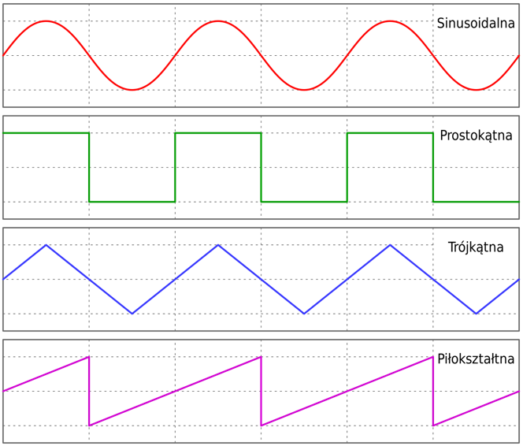
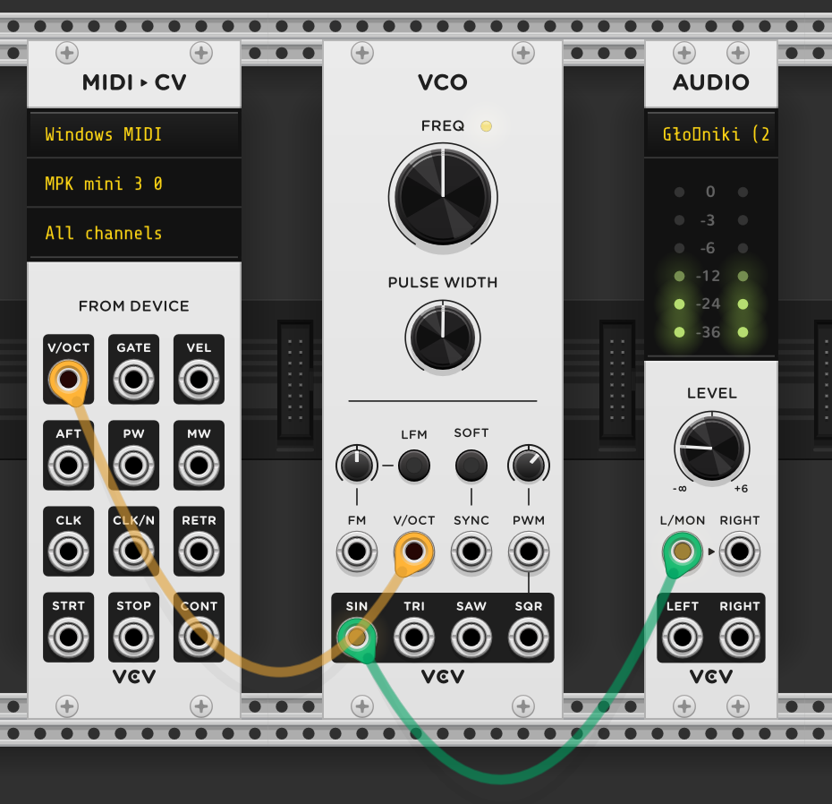
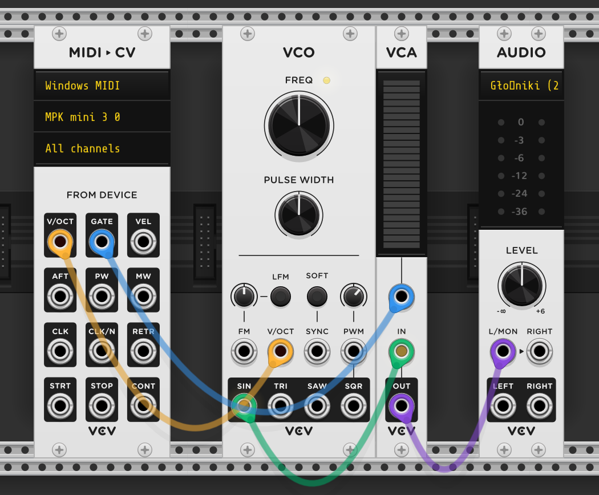
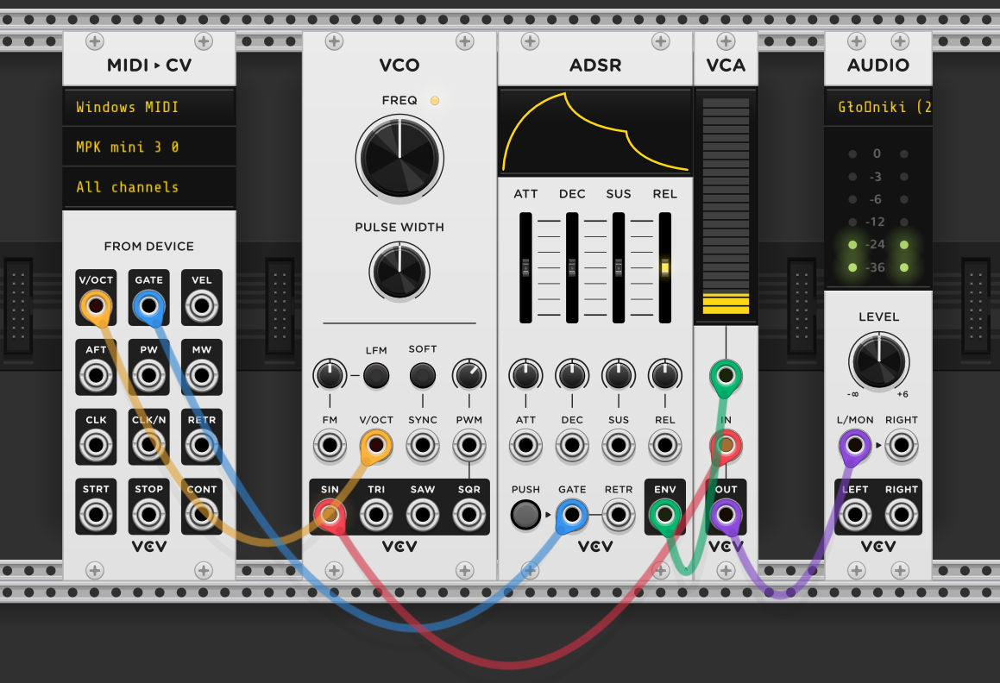
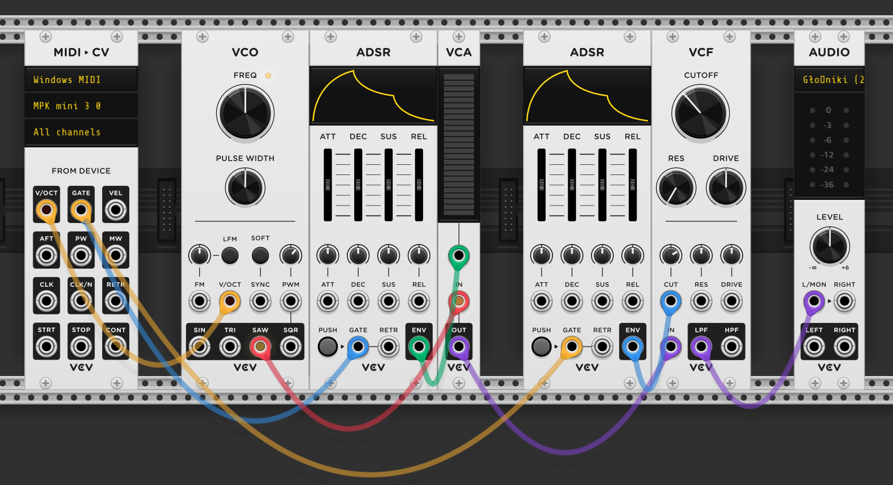
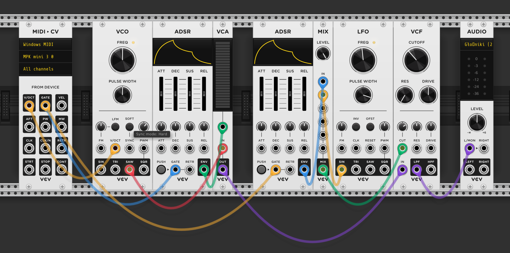

# Synteza subtraktywna dźwięku 🎶

Autor: Gerald Serafin

---

### Voltage controlled oscilator (VCO) 🔊

###

Układ elektroniczny generujący okresowy sygnał elektryczny (falę) o częstotliwości proporcjonalnej do napięcia elektrycznego podanego na wejście.

##

  Częstotliwośc fali wpływa na wysokość dźwięku. 

---

### Podstawowe fale

---

## Control Voltage (CV) 🎛️

Zmiana konkretnego parametru poprzez zmianę przychodzącego z zewnątrz napięcia.

---

## VCA 🎹

Moduł bramkujący. Przepuszcza dźwięk tylko przy podanym napięciu. Umożliwia odtważanie dźwięku generowanego przez oscylator tylko wtedy gdy klawisz na klawiaturze jest wciśnięty.

---

---

## Envelope generator (ENV) 🎷

#### Generator obwiedni

Moduł który po wyzwoleniu sygnałem bramkującym, odwzorowuje następujące fazy dźwięku:

- Czas narastania (Attack)​
- Moment osiągnięcia największej wartości (Decay)​
- Czas trwania (Sustain)​
- Czas zanikania (Release)

---

---

## Filter (VCF) ✂️

Moduł pozwalający uciąć cześć częstotliwości z dźwięku. Do automatycznego otwierania oraz zamykania filtra wykorzystuje się generator obwiedni.​

---

---

## LFO 🌿

Oscylator generujący fale o niskiej częstotliwości. Wykorzystywany głownie do modulacji parametrów innych modułów.

---

---

## Podsumowując

Synteza subtraktywna bazuje na dynamicznym odejmowaniu harmonicznych.
